# Lab Guide

## AI Studio Copilot

### Creating an Azure Open AI Resource in the Azure Portal

<!-- 
1. On your local computer, launch an incognito Chrome window and navigate to the below URL(s). Sign in using the credentials located in the **Lab Environment** tab of **labs.opsgility.com**. 

    ```
    https://portal.azure.com 
    ```
--> 

1. From inside the lab virtual machine, launch Chrome from the task bar.

    


1. Navigate to the Azure portal. 

    ```
    https://portal.azure.com 
    ```

1. When prompted, login with your Azure credentials displayed after you click the cloud icon.

    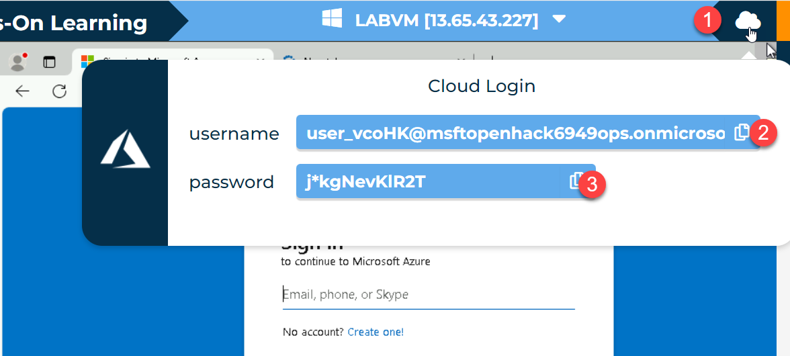

1. Click **Create a Resource** then search for and select **Azure OpenAI**. Click **Create**. 

    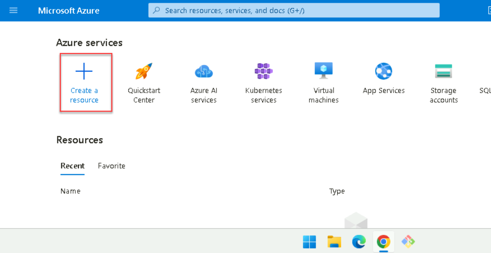

    

1. Create the OpenAI resource by first entering the following information. Click **Next** three times then click **Create**. 

    - Resource group: **Click *Create new* then enter *OpenAIRG* and click *OK***

    - Name: **Enter a unique name for your Open AI Resource**

    - Region: **East US**

    - Pricing Tier: **Standard S0**

    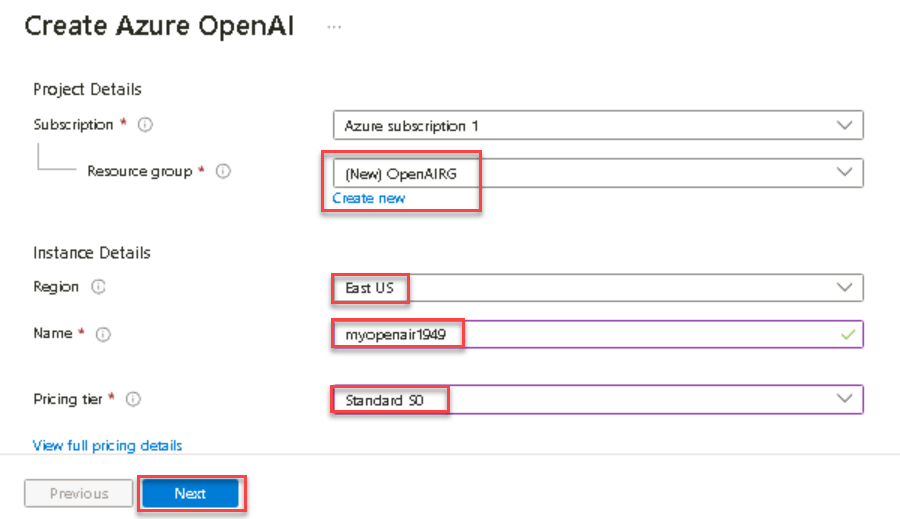

### Create an Azure Search Instance in the Azure Portal 

1. Click **Microsoft Azure** to return to the Azure portal's home page. Click **Create a Resource** then search for and select **Azure AI Search** and click **Create**.

    

    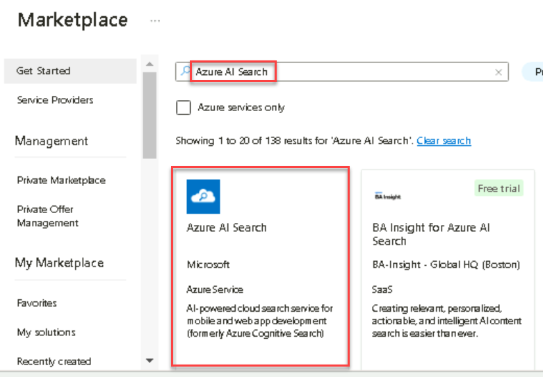


1. Enter the following information then click **Next: Scale**. Click **Review + Create** then **Create**. 

    - Resource Group: **OpenAIRG**

    - Service Name: **Enter a unique name for your Azure AI Search Resource**

    - Location: **East US**

    - Pricing Tier: **Standard** 

    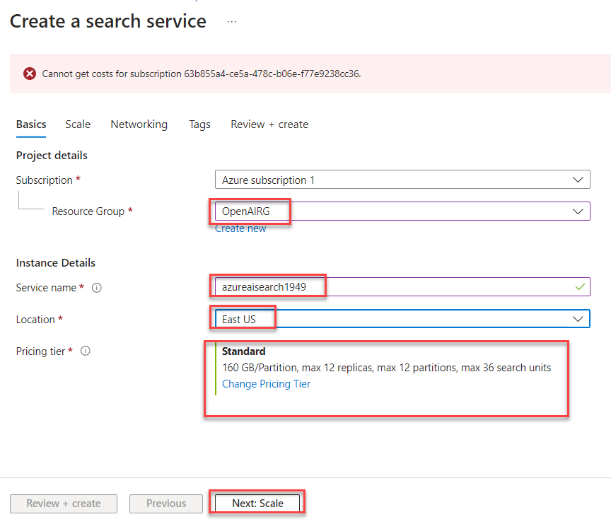

### Create a new AI Studio project using the Azure AI Studio Portal 

1. Navigate to the **AI Studio Portal** in a new browser tab.

    ```
    https://ai.azure.com/
    ```

1. Click **Sign in** on the top right. Sign in using your Azure credentials located in the **Lab Environment** tab if prompted. 

    

1. On the right navigation, **click + New Project**.


    
    
1. In the **Project details** popup change the **Project name** to **democopilot**, but leave the pre-generated characters at the end.

    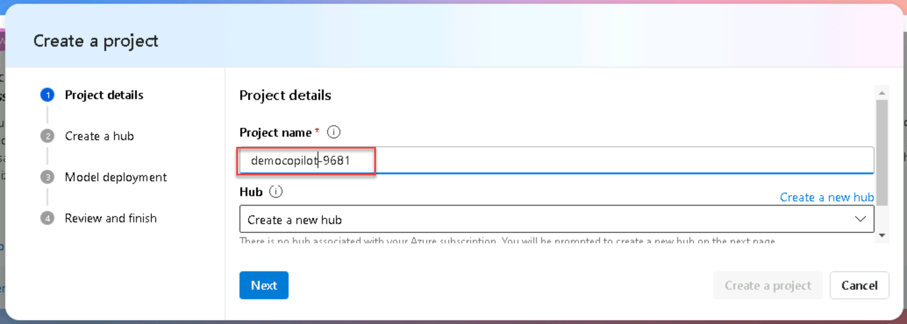
    
1. In the **Hub** section, click **Create a new hub**.

    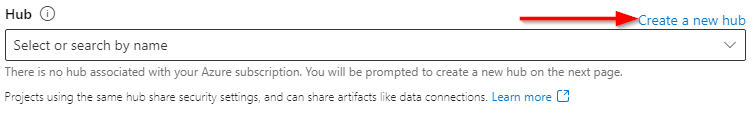
    
1. Enter the following information then click **Next**.

    - Subscription: **Azure Subscription 1**

    - Resource group: **OpenAIRG**

    - Location: **East US**
    
    - Connect Azure AI Services or Azure OpenAI: **Select the *Azure OpenAI Resource* you created earlier in the lab**

    - Connect Azure AI Search: **Select the *Azure AI Search Resource* you created earlier in the lab**

    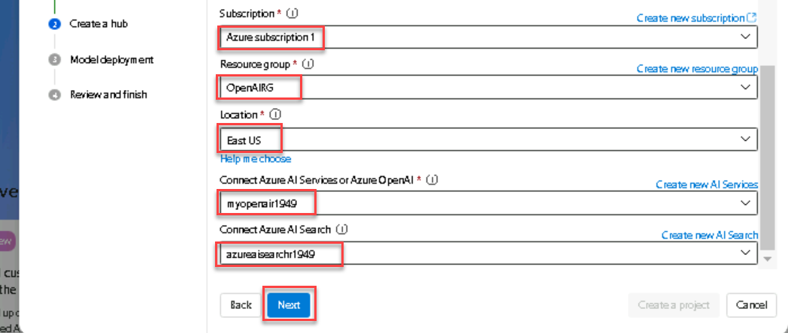

1. In the **Deploy a model to use the chat playground** step, leave the default values, then click **Next**

    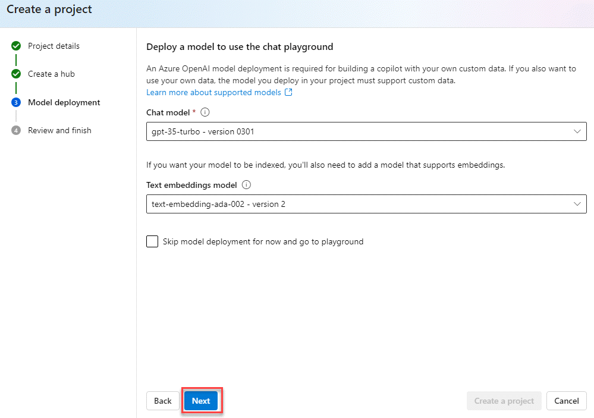
    
1. In the final step, click **Create a project**.

    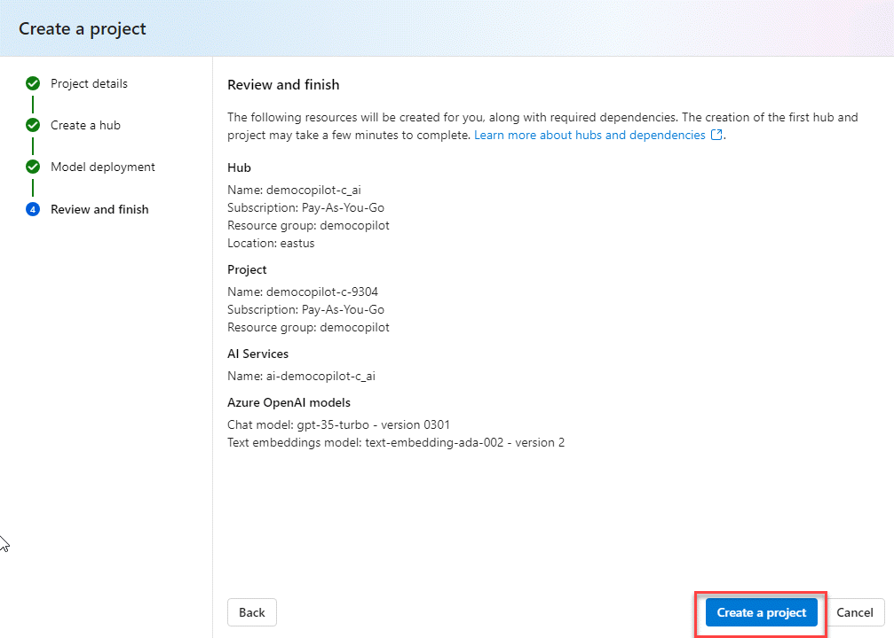


<!-- TODO update --> 
    
1. In the **Review and finish** step, watch all the resources create. Wait for green circles on each resource.

    


1. Click **Model Catalog** on the left navigation.

    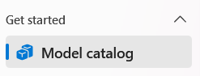

1. Search for **gpt-35-turbo** and select **gpt-35-turbO** from the results.

    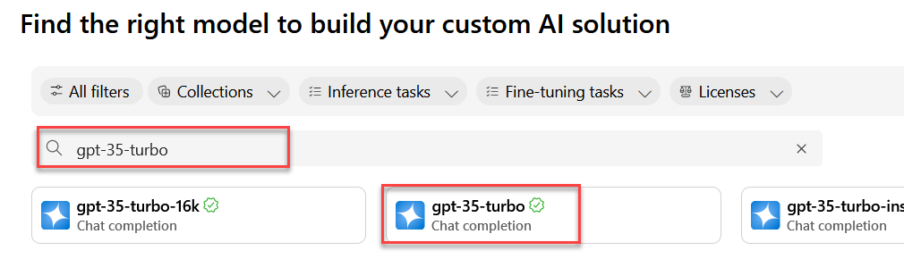

1. On the next screen, click **Deploy**.

    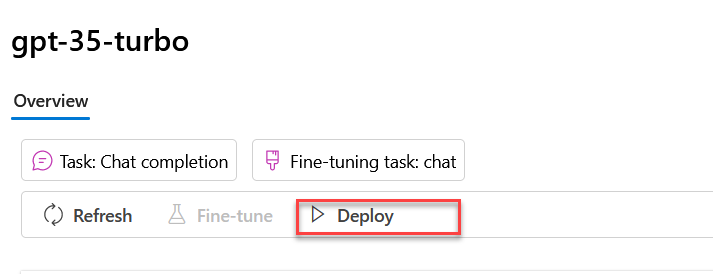

1. Accept the default values, and scroll to the bottom and click **Deploy**.

    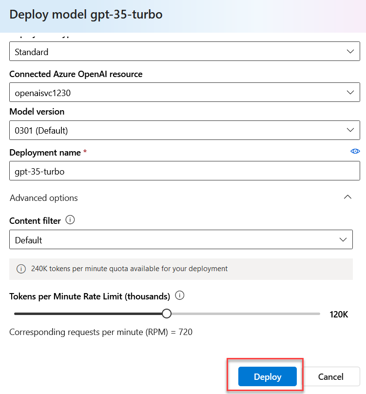


1. Download and extract these files to your local device.

    ```
    https://tinyurl.com/yz5tucbk
    ```

1. Back in the Azure AI Studio portal, on the left navigation, click **Chat**.

    


1. Click on the **Add your data** tab. 

    

1. Then click **+ Add a new data source**

    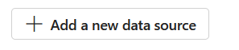

1. On the **Data source** dropdown, select **Upload files**

    
    
1. Click **Upload** then select **Upload files**.

    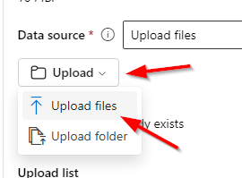

1. Select the files you just downloaded and extracted. 

    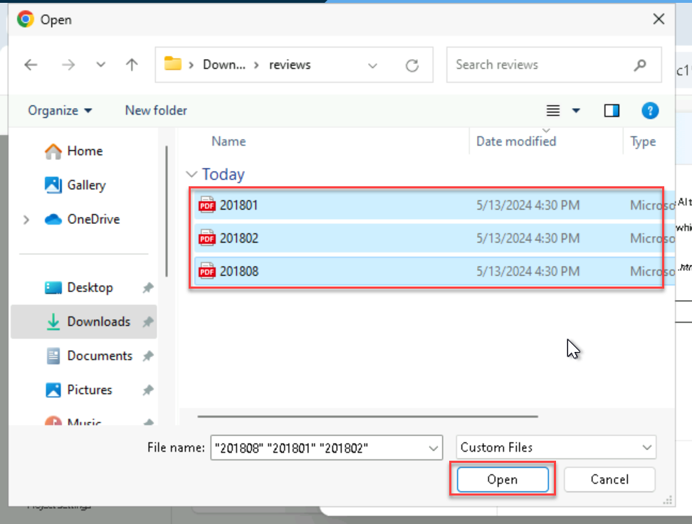

1. Once the three files are uploaded your page should resemble the following. Click **Next**

    
    
1. In the **Select Azure AI Search Service** dropdown, select the **Azure AI Search Resource** you created and connected earlier. Leave the default **Index name** and click **Next**

    

1. In the **Select an embedded model** dropdown, select the **Azure OpenAI Resource** you created earlier then click **Next**.

    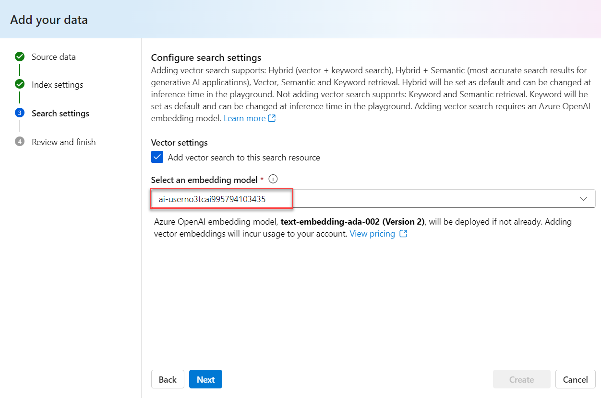
    
1. On the final step of the wizard click **Create**. This will take a while. Important - do not navigate away from the screen.

    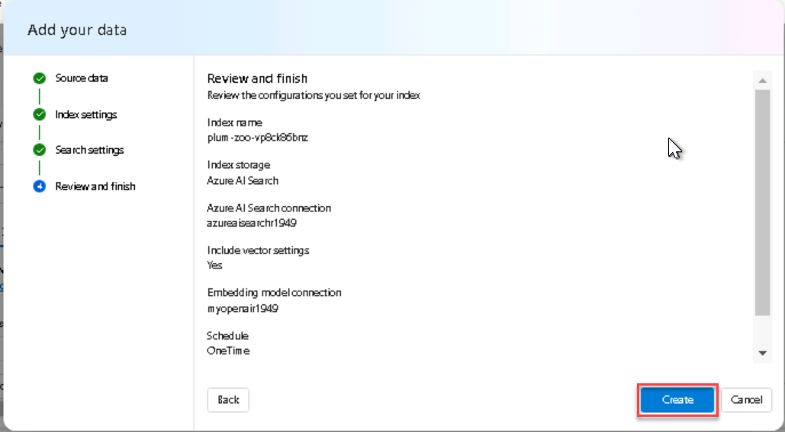
    
1. You will see several progression steps:

    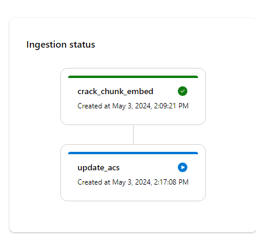
    
1. When the process is created it will resemble the following:

    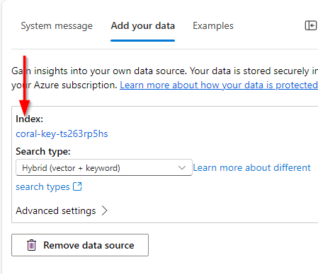
    
1. Change the **Search type** dropdown to **Keyword**

    

    
1. In the middle **Chat** pane, enter the prompt **tell me about hotels in Dubai** and click the **Submit** button.

    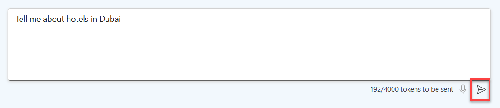

1. The results should resemble the following:

    
    
1. Click **Prompt flow** towards the top of the page.

    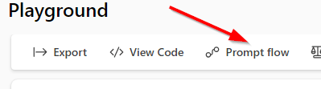

1. At the prompt, click **Open**

    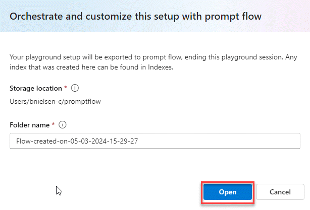
    
1. Here is the flow output.

    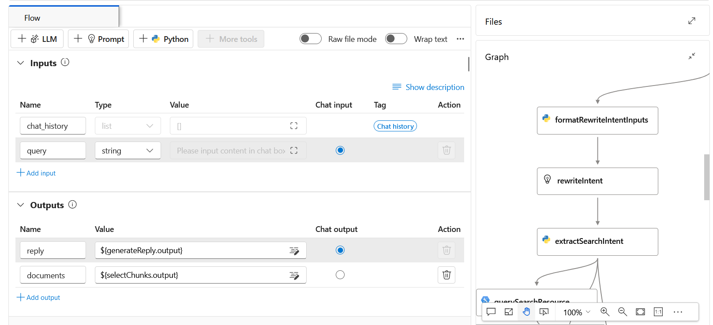
    
1. In the **Runtime** dropdown towards the top of the page, select **Start**. Wait a few minutes for the run time to be completed.

    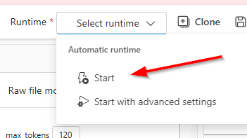

    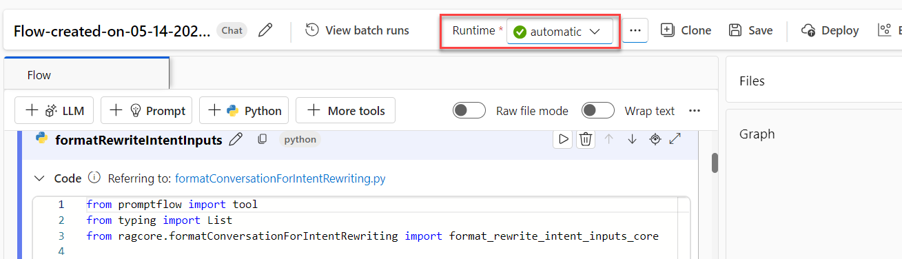

1. Click **Chat** on the upper right corner of the pane.

    
    
1. Enter **dubai** into the chat pane that appears and view the results

    
    
1. Enter **Are there any good hotels in Dubai?** into the chat pane and view the results.

    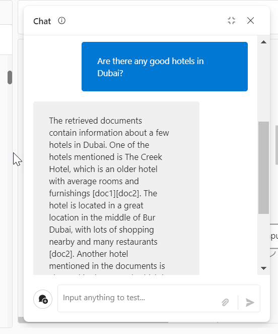

1. Click **Save** at the top of the page and then click the **All Hubs** link in the navigation.

    

1. You are finished with this exercise. You can continue to exercise 2.