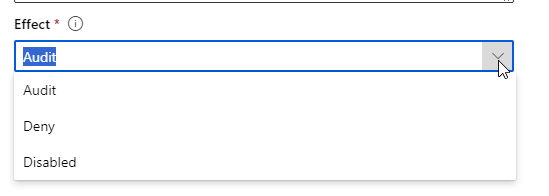

## Exercise 2- AI Studio AI Hubs

### Accessing Azure AI Hubs

    
1. Click on your previously created **Hub**.

    

    >**Note:** The name of your hub will be different than what is in the screenshot. 
    
1. On the **Hub** settings page that appears, click the **+ New member** button in the bottom right corner of the page.

    
    
1. This account doesnt have additional users to add. Expand the **Role** dropdown to see the different roles available.

    
    
1. This is an explanation of the roles available.

    <table>
    <thead>
    	<tr>
    		<th>Role</th>
    		<th>Description</th>
    	</tr>
    </thead>
    <tbody>
    	<tr>
    		<td>Owner</td>
    		<td>Full access to the Azure AI hub resource, including the ability to manage and create new Azure AI hub resources and assign permissions. This role is automatically assigned to the Azure AI hub resource creator</td>
    	</tr>
    	<tr>
    		<td>Contributor</td>
    		<td>User has full access to the Azure AI hub resource, including the ability to create new Azure AI hub resources, but isn't able to manage Azure AI hub resource permissions on the existing resource.</td>
    	</tr>
    	<tr>
    		<td>Azure AI Developer</td>
    		<td>Perform all actions except create new Azure AI hub resources and manage the Azure AI hub resource permissions. For example, users can create projects, compute, and connections. Users can assign permissions within their project. Users can interact with existing Azure AI resources such as Azure OpenAI, Azure AI Search, and Azure AI services.</td>
    	</tr>
    	<tr>
    		<td>Reader</td>
    		<td>Read only access to the Azure AI hub resource. This role is automatically assigned to all project members within the Azure AI hub resource.</td>
    	</tr>
    </tbody>
    </table>

1. Click the **Cancel** button on the **Add resource members** dialog.

    

1. Click **Compute instances** on the left navigation. You can use **Compute instances** in the following:  

    - Prompt flows

    - Indexes

    - Visual Studio Code

    

1. Click the **+ New** button.

    
    
1. In the **Create Compute Instance** dialog, enter a unique name for the **Compute name** then select any of the virtual machines under **Virtual machine size**. Click **Next** (do **NOT** create).

    
    
1. Leave the default settings but this is where we setup the schedule for the VM. By default it will shutdown after 60 minutes of inactivity. Let's add a late night schedule. Click the **Add schedule** button

    
    
1. Select **Start compute instance** then click the **Add schedule** button

    
    
1. In the **Shutdown every...** section change the **Shutdown time** to **11:00PM** then click **Next**.

    
    
1. In the **Security** section of this wizard you can configure the following but we will leave the default settings. Click **Next**.

    - User assignment

    - Assigned identity

    - Enabling SSH access
    
    
    
1. Leave the default settings for the **Tags** section and click **Next**

1. We arent going to create a **Compute instance** that is dedicated for this so click the **Cancel** button to close the wizard. Then click **Leave** when prompted.

    

1. Click **Connected resources** on the left navigation. Here are all the resources that are currently available. We walked through the steps to add a new **Connected resource** in the first exercise.

    

>**Note:** Steps to view policy and billing information are not included due to changes in policy management functionality as well as being unable to display CSP subscription pricing. 

<!-- 1. In the navigation click on the **Policies** button

1.  Click on the **Add policy** button 

    
    
1. Expand the first dropdown to see the the available policy options. Select the policy that says **Compute instances should have idle shutdown turned on**

    
    
1. In the **Effect** section expand the options and leave the default at **Audit**

    
    
1. Click the **Cancel** button to stop creating a new policy

1. Click on the **Billing** link in the side navigation

1. Click on the **View cost for resources**  button to open a new tab. 

    
    
1. By default the **Cost analysis** is broken down by **Resource Group** so it is very important to use dedicated **Resource Groups** for each **Hub**

     -->