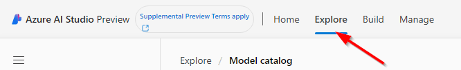
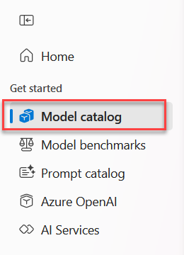
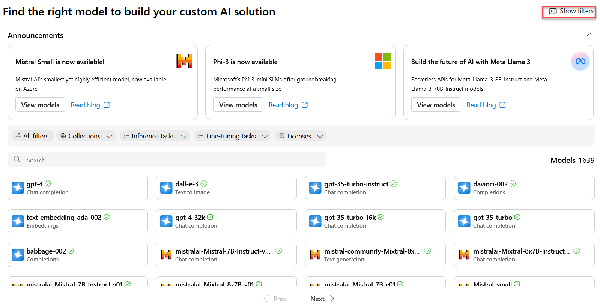
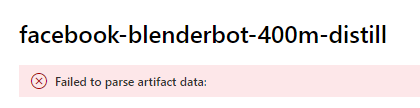
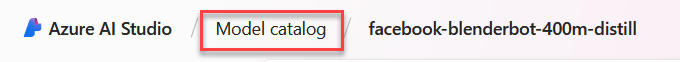
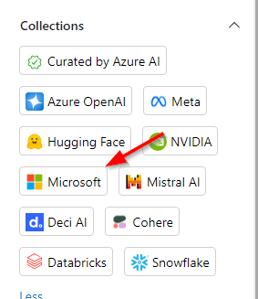
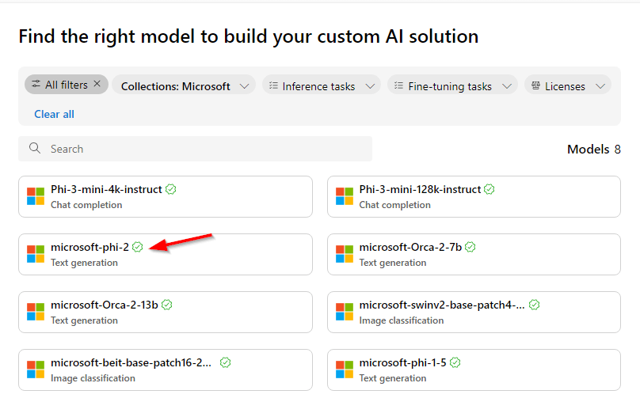
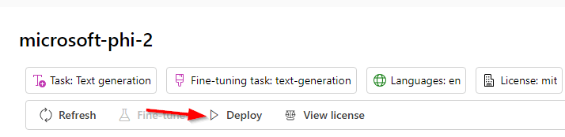
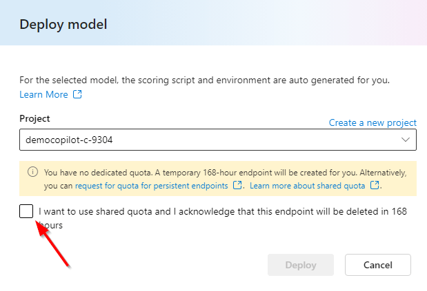
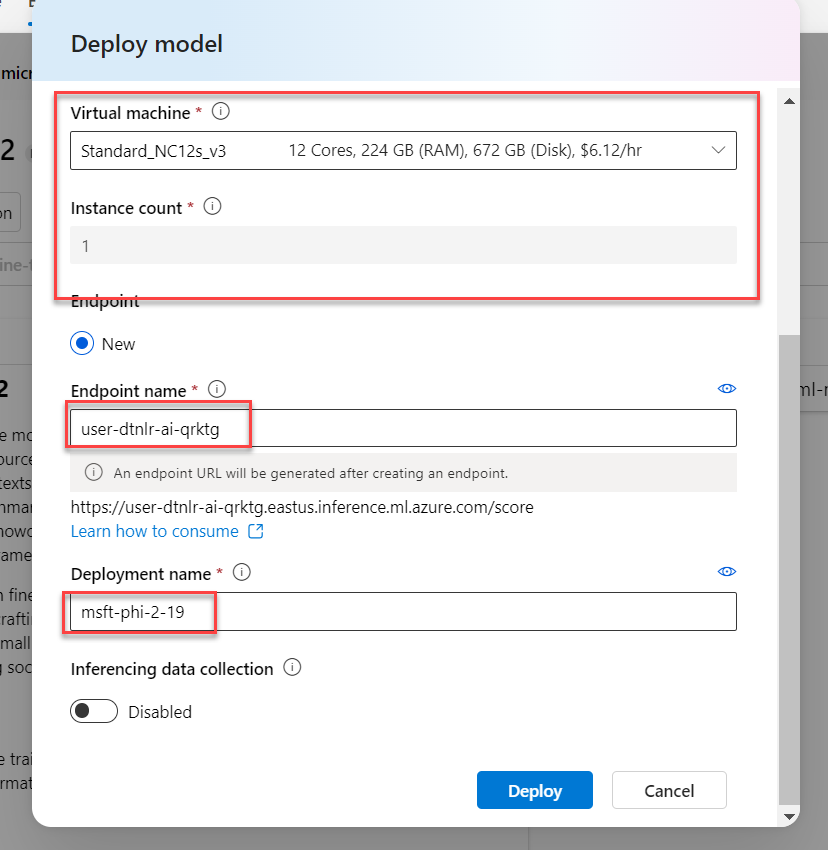

## Exercise 3- AI Studio Explore

### Model catalog

1. Click **Explore** towards the top of the page. 

    
    
1. You will see the resulting model catalog. You will notice this is vastly different than the 4-5 models available in the current AI Studio.

    
    
1. Click **Show filters** then click the **Hugging Face** icon.

    

    
    
    >**Note:** Hugging Face has over 600,000 models available https://huggingface.co/. 

1. After filtering for Hugging Face models click the **Inference tasks** dropdown and select **Conversational** 

    
    
1. Look for the **facebook-blenderbot-400m...** and select it.

    
    
1. You should see an error message that says **Failed to parse artifact data** at the top of the page. 

    
    
1. Click **Model catalog** at the top of the page. 

    
    
1. This time click the **Microsoft** collection

    
    
1. Select the **microsoft-phi-2** model.

    
    
1. On the **microsoft-phi-2** page, view the **Description** section then scroll down to the **Sample inputs and outputs (for real-time inference)** section.

1. At the top of the page, click **Deploy** button.

    
    
1. In the **Deploy model** dialog, select the **democopilot...** project created earlier in the lab. Check the **I want to use shared quota...** box.

    
    
1. The dialog will update to display the **Virtual machine** options. In the bottom section you can adjust the **Endpoint name** and the **Deployment name**

    
    
1. **Important: Do Not deploy - click **Cancel**  in the dialog. 

    