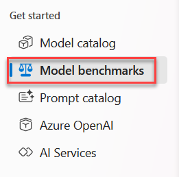
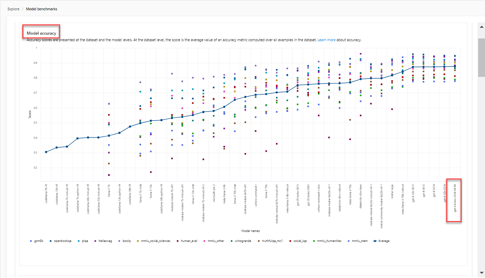
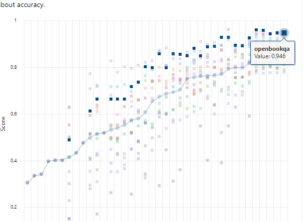
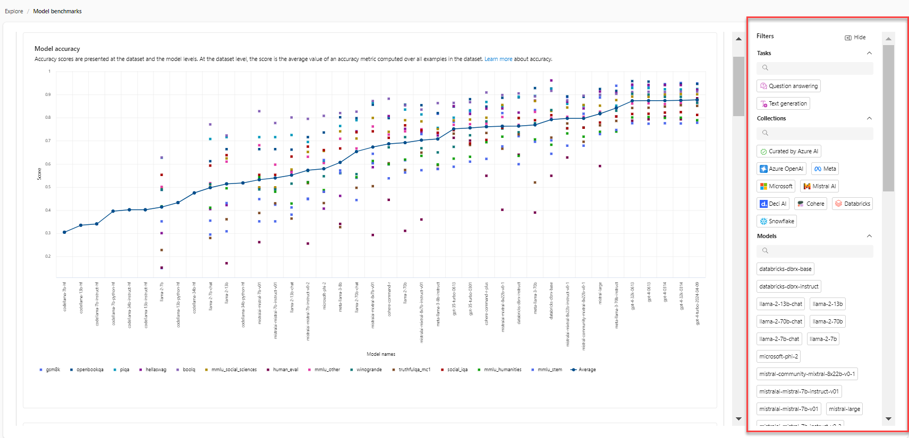

## Exercise 4- AI Studio Explore

### Model benchmarks

    
1. Click **Model benchmarks** on the left navigation.

    
    
1. Scroll down in the middle section to look at the **Model accuracy** section. You will notice that the **gpt-4-turbo-2024-04-09** is the most accurate model but all of the gpt-4 models are fairly close.

    
    
1. Using your mous, mouse-over the top blue squares until you see the **openbookqa** dataset.

    
    
1. In the far right pain you can filter on the following:

    - Tasks
    
    - Collections

    - Models

    - Inference tasks

    - Fine-tuning tasks

    - Licenses

    