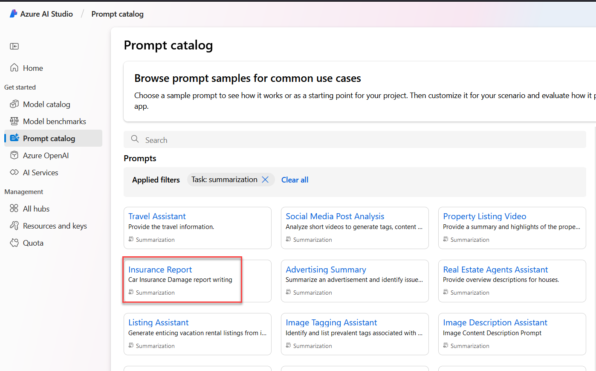

## Exercise 5- AI Studio Explore


### Prompt catalog

1. Click **Prompt catalog** on the left navigation.

    

1. In this page you can learn additional prompting skills. Let's start by selecting a task in the **Filters** pane. Select **Summarization**.

    
    
1. Now click on the **Insurance Report** option

    
    
1. Scroll down and view the attached video. 

    
    
1. Click **Prompt catalog** on the left navigation and search for **Shakespearean** then choose the **Shakespearean Writing Assistant** option.

    
    
1. Click **Open in playground** near the top of the page.

    

<!-- new ai studio doesn't prompt - I assume it defaults
1. In the dialog, select the **democopilot..** project created earlier in the lab then click **Select**. 

    
-->

1. Notice how the **System message** has been updated.

    
    
1. Enter the following in the middle chat pane.

    ```
    how should I make a reservation to a restaurant?   
    ```

1. The result will be similar to the following:

    