## Exercise 6- AI Studio Build

Extracting valuable information from text is known as Named Entity Recognition (NER). Entities are key words that are of interest to you in a given text.


Large Language Models (LLMs) can be used to perform NER. To create an application that takes a text as input and outputs entities, you can create a flow that uses a LLM node with prompt flow.

In this exercise, you'll use Azure AI Studio's prompt flow to create an LLM application that expects an entity type and text as input. It calls a GPT model from Azure OpenAI through a LLM node to extract the required entity from the given text, cleans the result and outputs the extracted entities.


You first need to create a project in the Azure AI Studio to create the necessary Azure resources. Then, you can deploy a GPT model with the Azure OpenAI service. Once you have the necessary resources, you can create the flow. Finally you'll run the flow to test it and view the sample output.

### Prompt flow

1. Click the Home button in the top left navigation.

    

1. Click your project from recent projects.

    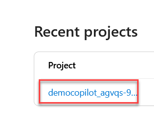

1. Click **Prompt flow** on the left navigation then click **+ Create**. 

    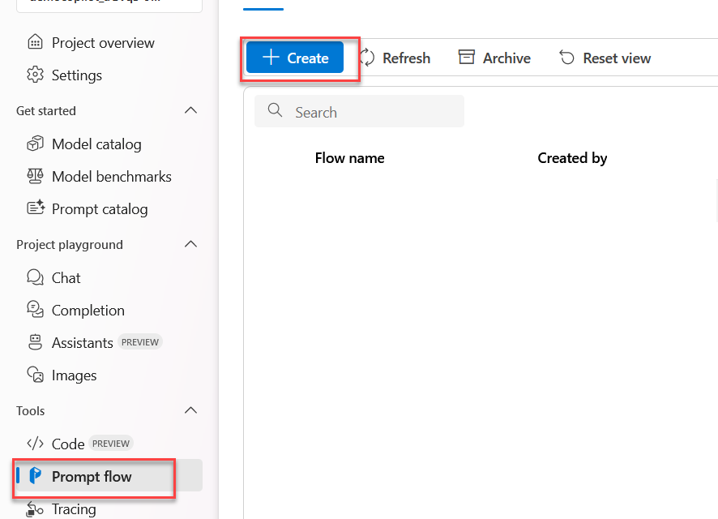
    
1. In the dialog that appears, click **Create** under **Standard flow**. 

    
    
1. In the **Create a new flow** pane that appears, change the **Folder name** to **entity-recognition** and click **Create**. 

    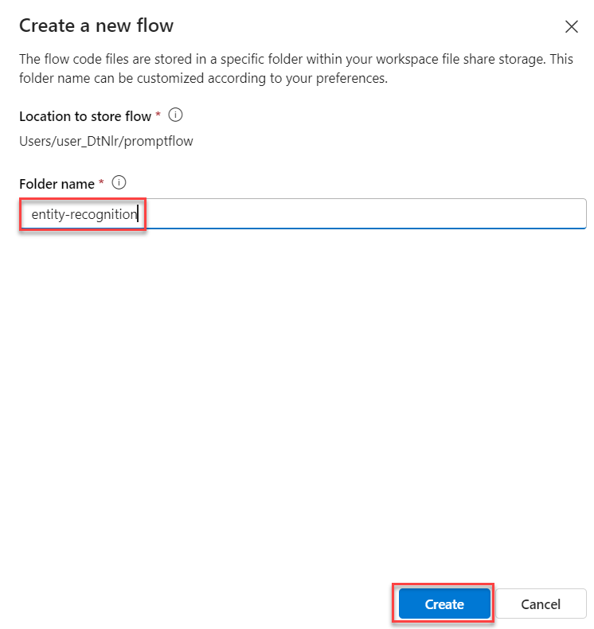
    
### Start the automatic runtime

To test your flow, you need compute. The necessary compute is made available to you through the runtime.

1. After creating the new flow that you named `entity-recognition`, the flow should open in the studio.

1. Select **Start** in the **Runtime** dropdown at the top of the page to start the automatic runtime.

    

1. Wait a few minutes for the run time to be completed.

    

### Configure the inputs

The flow you'll create will take two inputs: a text and the type of entity you want to extract from the text.

1. In the **Inputs** section, enter the following information: 

    - Name: **entity_type**

    - Type: **string**

    - Value: **job title**

    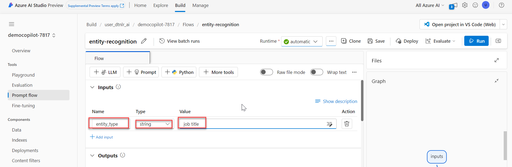

1. Click **+ Add input**.

    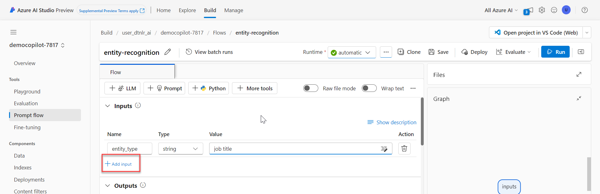

1. Enter the following information for the second input.

    - Name: **text**

    - Type: **string**

    - Value: **The software engineer is working on a new update for the application.**

    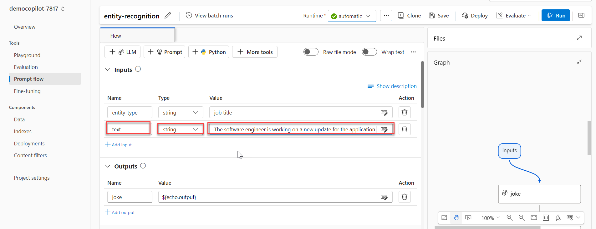
    
### Configure the LLM node

The standard flow already includes a node that uses the LLM tool. You can find the node in your flow overview. The default prompt asks for a joke. You'll update the LLM node to extract entities based on the two inputs specified in the previous section.

1. Select the LLM node, **Joke**, on the right pane. 

    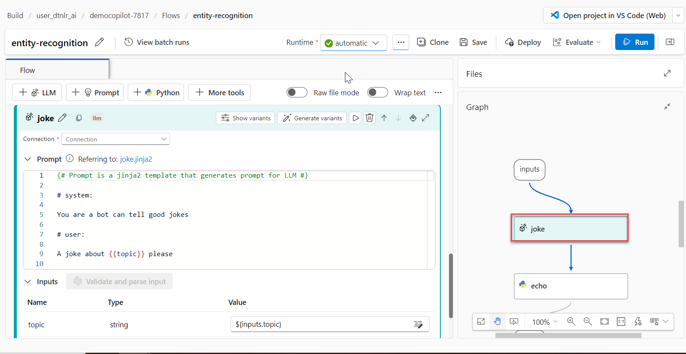

1. Click the pencil icon then replace the text with **NERLLM** and press **Enter** to rename the node. 

    

    

1. In the **Connection** dropdown, select the OpenAI connection created earlier in the lab.

    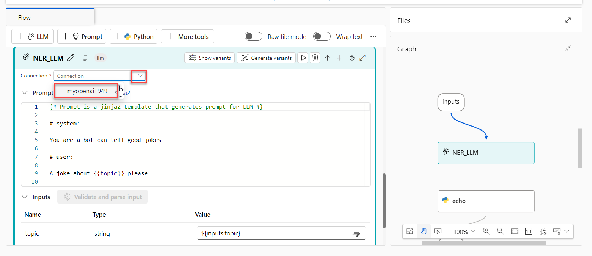

1. In the **deployment_name** dropdown, select the **gpt-35-turbo** model deployed earlier in the lab.

    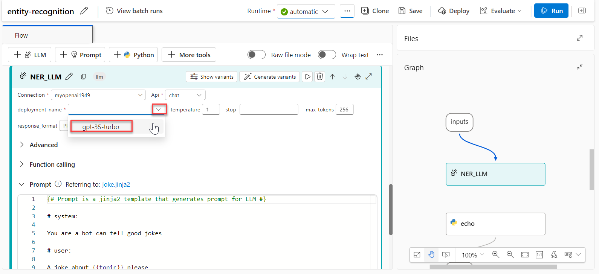

1. Replace the contents of the **Prompt** field with the following. Then click **Validate and parse input**.

   ```yml
   # system:

    Your task is to find entities of a certain type from the given text content.
    If there're multiple entities, please return them all with comma separated, e.g. "entity1, entity2, entity3".
    You should only return the entity list, nothing else.
    If there's no such entity, please return "None".
    
    # user:
    Entity type: {{entity_type}}
    Text content: {{text}}
   ```

   

1. In the **NETLLM** section, under **Inputs**, enter the following information. 

    - entity_type: **${inputs.entity_type}**

    - text: **${inputs.text}**

    

Your LLM node will now take the entity type and text as inputs, include it in the prompt you specified and send the request to your deployed model.

### Configure the Python node

To extract only the key information from the result of the model, you can use the Python tool to clean up the output of the LLM node.

1. Select the Python node, **echo**, on the right pane. 

    

1. Click the pencil icon then replace the text with **cleansing** and press **Enter** to rename the node. 

    

    

1. Replace the contents of the **Code** section with the following then click **Validate and parse input**.

   ```python
   from typing import List
   from promptflow import tool
    
    
   @tool
   def cleansing(entities_str: str) -> List[str]:
       # Split, remove leading and trailing spaces/tabs/dots
       parts = entities_str.split(",")
       cleaned_parts = [part.strip(" \t.\"") for part in parts]
       entities = [part for part in cleaned_parts if len(part) > 0]
       return entities
    
   ```

   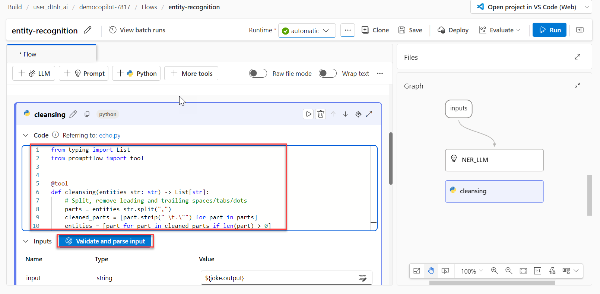

1. In the **Cleansing** section, under **Inputs**, enter the following information. 

    - entities_str: **${NER_LLM.output}**

    

### Configure the output

Finally, you can configure the output of the whole flow. You only want one output to your flow, which should be the extracted entities.

1. In the **Outputs** section, enter the following information then click **Save**. 

    - Name: **entities**

    - Value: **${cleansing.output}**

    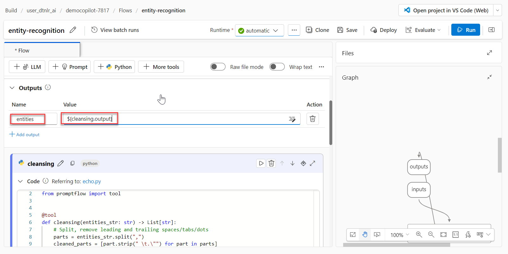

### Run the flow

Now that you've developed the flow, you can run it to test it. Since you've added default values to the inputs, you can easily test the flow in the studio.

1. Select **Run** to test the flow.

    

1. Wait until the run is completed.

    

1. Select **View full output** in the **NERLLM** section. A dialog should appear showing you the output for the default inputs. Optionally, you can also inspect the logs.
    
    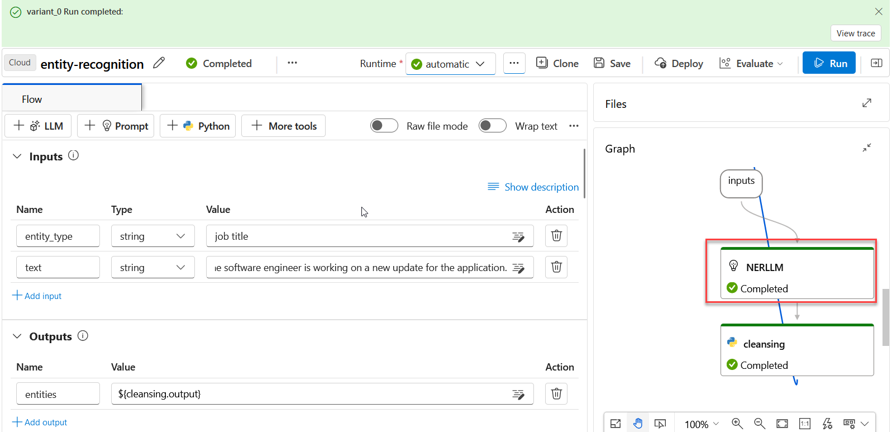

    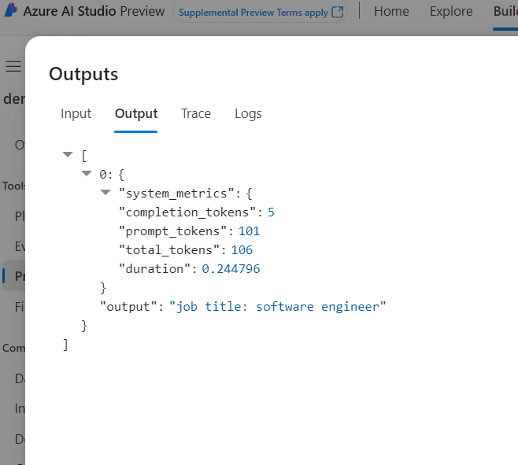